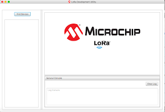

# LoStik


LoStik is an affordable, easy to use, LoRaWAN™ compatible device. It lets IoT (Internet of Things) integrators, network testers, and hobbyists get connected to a LoRa® network faster, diagnose network issues more easily, and build new and exciting connected devices.  LoStik is currently available to purchase on [Crowd Supply](https://www.crowdsupply.com/third-venture/lostik).

## Examples

Python examples require Python 3.  Be sure to install the dependiencies in requirements.txt

    pip install -r requirements.txt

### Miniterm

miniterm.py is a light weight terminal emulator that works well with LoRa stick. 
The RN2903/R2483 radios require \r\n line ending and run at 57600 baud.

    ./miniterm.py --echo /dev/ttyUSB0 57600

### Blinky

blinky.py is for testing the user LEDs on the LoRa Stik.  There is a red led tied to GPIO11 and a blue led tied to GPIO10. 

    ./blinky.py  -m blue -d 1 /dev/ttyUSB0

will blink the blue led once per second

    ./blinky.py -m both -d .5 /dev/ttyUSB0

will alternate the blue and red leds every .5 seconds.

### Packet Radio

radio_receiver.py and radio_sender.py are used for sending LoRa packets between two LoRa Stiks without the need for a LoRaWAN gateway.  The included example sends a unix timestamp packet every 2 seconds and the receiver prints the incoming packets to stdout.

## Resources

For detailed infomation about available commands checkout one of the following docs:
* [RN2903 Command Reference](http://ww1.microchip.com/downloads/en/DeviceDoc/40001811A.pdf)
* [RN2843 Command Reference](http://ww1.microchip.com/downloads/en/DeviceDoc/40001784B.pdf)

### GUI
Microchip offers a programm called "Lora Dev Utility" that is part of the [LoRa Development Suite](https://www.microchip.com/developmenttools/ProductDetails/dv164140-1)



## Platform Notes

For platform specific notes see:

* [Windows](docs/windows.md)
* [Mac](docs/mac.md)
* [Linux](docs/linux.md)


## License

### Software

All software and example scripts are MIT licensed.  For details see [LICENSE](blob/master/LICENSE)

### Hardware
Hardware design and schematics are licenede under Creative Commons CC-BY-SA-NC  For details see [hardware/LICENSE.md](blob/master/hardware/LICENSE.md)

### User LEDS

LoStik has two user LEDs that you can control via the UART interface on GPIO10 and GPIO11 and can be accessed using the following commands:

```sys set pindig GPIO10 1``` (turns on blue LED)

```sys set pindig GPIO10 0``` (turns off blue LED)

```sys set pindig GPIO11 1``` (turns on red LED)

```sys set pindig GPIO11 0``` (turns off red LED)


<sup>LoRa® and LoRaWAN™ are trademarks of Semtech Corporation or its subsidiaries.</sup>
