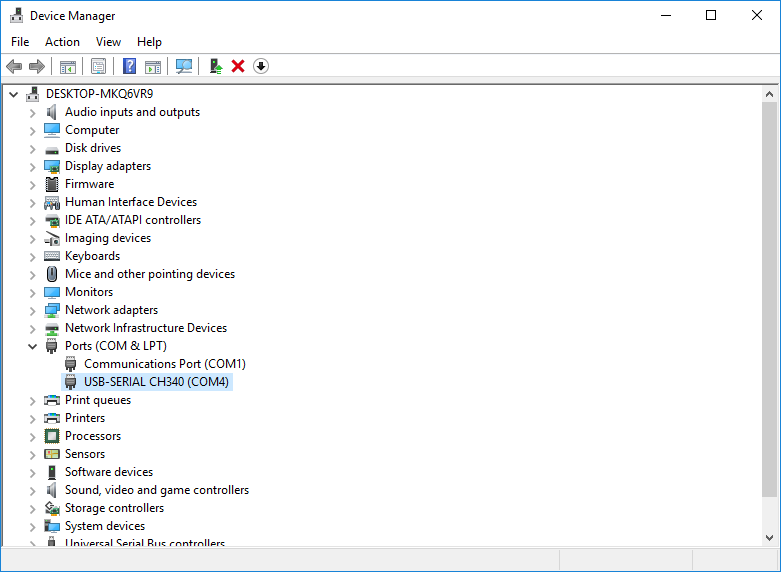
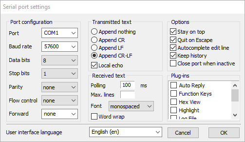

# CH340G Driver

Windows requires the installation of the CH340 USB to Serial Driver.  [Download Link](http://www.wch.cn/downloads/file/65.html)

Once installed you should should see a new COM port in device manager that appears as a CH340 serial device.

# Terminals

* **Termite** - [Termite](https://www.compuphase.com/software_termite.htm) is a friendly terminal emulator and is the recommended route if you do not wish to install python.  Besure to check the options below, including `Append CR-LF` and `Local echo`.

* **miniterm.py** - [examples/miniterm.py](../examples/miniterm.py) is a python terminal emulator that is recommended for use along with the python examples provided in this repository.
* **Putty** - Although Putty is very popular, the RN2903/RN2483 require \r\n endings which is not a configuration option in vanilla putty.

# GUI
Microchip offers a programm called "Lora Dev Utility" that is part of the [LoRa Development Suite](https://www.microchip.com/developmenttools/ProductDetails/dv164140-1)

